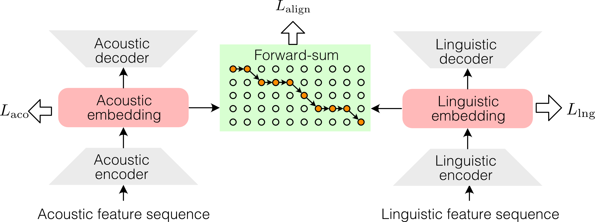
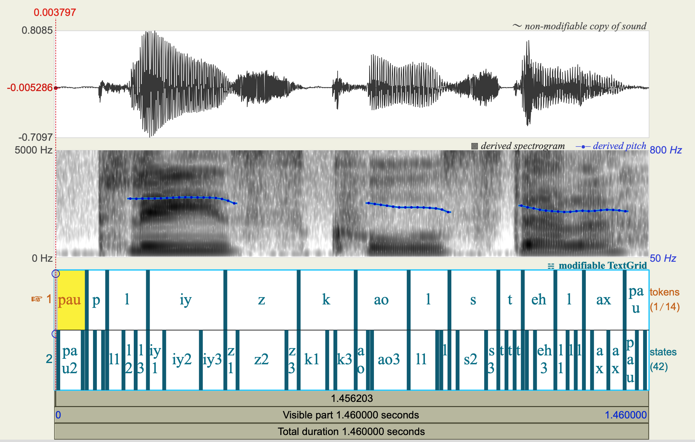

# VAE Speech Align

Unsupervised phoneme alignment based on a variational autoencoder
(VAE) with gradient annealing and self-supervised learning (SSL)
acoustic features. Given speech audio and its phoneme sequence, the
model estimates the start and end time of every phoneme without any
manually aligned training data.

This repository is the official implementation of the following paper:

> Tomoki Koriyama,
> "VAE-based Phoneme Alignment Using Gradient Annealing and SSL
> Acoustic Features,"
> *Proc. Interspeech 2024*, pp. 3814–3818.
> [[paper]](https://doi.org/10.21437/Interspeech.2024-1127)

Alignment results compared with other methods are available at
https://github.com/hyama5/vae_align.

## Model Architecture



The linguistic and acoustic feature sequences are embedded into a
shared space by their respective encoders. The forward-sum objective
(`L_align`) marginalizes over all monotonic alignment paths between the
two embedding sequences, while the decoders reconstruct each input
sequence (`L_ling`, `L_aco`) so that the embeddings retain the
information of the original features.

## Method Overview

- **VAE-based alignment model** — a linguistic encoder embeds phoneme
  tokens and an acoustic encoder embeds frame-level acoustic features
  into a shared matching space; decoders reconstruct both streams so
  the latent spaces stay informative.
- **SSL acoustic features** — frame features are extracted with a
  pretrained SSL model (wav2vec 2.0 / HuBERT / WavLM); a
  mel-spectrogram extractor is also available.
- **Forward-sum alignment likelihood** — the monotonic
  phoneme-to-frame alignment is marginalized with the forward
  algorithm, with a beta-binomial position bias.
- **Gradient annealing** — the alignment posterior is smoothed with a
  Gaussian kernel whose width is annealed during training, which
  avoids local optima in early training.
- **Viterbi decoding** — the trained model outputs per-phoneme and
  per-state durations and Praat TextGrid files.
- The alignment dynamic programming has interchangeable
  implementations: `numba` (CPU) and `triton` (GPU).

## Installation

Requires Python ≥ 3.10 and PyTorch ≥ 2.11.

```bash
git clone <this repository>
cd vae_speech_align

# with uv (recommended)
uv sync

# or with pip
pip install -e .
```

The pretrained models used by the inference example are distributed
via [GitHub Releases](https://github.com/CyberAgentAILab/vae_speech_align/releases)
and are downloaded automatically the first time each example's
`run_align.sh` runs.

## Quick Start: Alignment with Pretrained Models

Ready-to-run inference examples for Japanese and English, including
sample audio, are in [`example/inference`](./example/inference):

```bash
cd example/inference/ja   # Japanese; or example/inference/en for English
uv run bash run_align.sh
```

This converts the sample texts to phonemes (kana-based front-end for
Japanese, G2P to the VCTK ARPABET set for English), runs Viterbi
alignment, and writes TextGrids and duration files to `output/`. See
[`example/inference/README.md`](./example/inference/README.md) for
details and for how to align your own recordings.

### Example Output



*Screenshot of Praat*, showing the alignment produced by the English
model for [VCTK](./example/train/vctk) utterance `p225_001` ("Please
call Stella"). From top to bottom: the waveform, the spectrogram with
the pitch contour, and the generated TextGrid. The TextGrid has two
tiers — the 14 aligned phoneme tokens
(`pau p l iy z k ao l s t eh l ax pau`) and the 42 sub-phoneme
states, three per phoneme, from the linguistic upsampling factor.

## Training

Training recipes reproducing the paper's setup are provided for two
corpora:

- [`example/train/jvs`](./example/train/jvs) — JVS corpus (Japanese)
- [`example/train/vctk`](./example/train/vctk) — VCTK corpus (English)

Each recipe contains `prepare_data.sh`, `run_train.sh`, and
`run_align.sh` together with the experiment configuration
(`config.yaml`).

## Repository Structure

```
vae_speech_align/       # main package
├── cli/                # command-line entry points (train, align)
├── model/              # VAE alignment model, losses, annealing,
│                       # position bias, acoustic feature extractors
├── forwardsum/         # forward-sum / Viterbi DP (numba, triton, torch)
├── g2p/                # text front-ends (Japanese kana, English G2P)
├── config.py           # experiment configuration dataclasses
├── dataset.py          # WAV + phoneme-label dataset and dataloader
└── utils.py            # TextGrid writing, masking utilities
example/
├── inference/          # alignment with pretrained models (ja / en)
└── train/              # training recipes (jvs / vctk)
docs/images/            # figures used in this README
test/                   # unit tests (pytest)
```

## Testing

```bash
uv run pytest test/
```

## Citation

If you use this code, please cite:

```bibtex
@inproceedings{koriyama24_interspeech,
  title     = {VAE-based Phoneme Alignment Using Gradient Annealing and SSL Acoustic Features},
  author    = {Tomoki Koriyama},
  booktitle = {Proc. Interspeech 2024},
  pages     = {3814--3818},
  year      = {2024},
  doi       = {10.21437/Interspeech.2024-1127},
}
```

## License

This project is licensed under the [MIT License](./LICENSE).
Note that `example/train/jvs/data/phoneme.tar.gz` is distributed under
CC BY-SA 4.0 (see [`example/train/jvs/README.md`](./example/train/jvs/README.md)).

The pretrained Japanese model (`model_ja.safetensors`, distributed via
GitHub Releases) is a product obtained by using the
[Corpus of Spontaneous Japanese (CSJ)](https://clrd.ninjal.ac.jp/csj/en/)
and was trained under the CSJ usage agreement.
